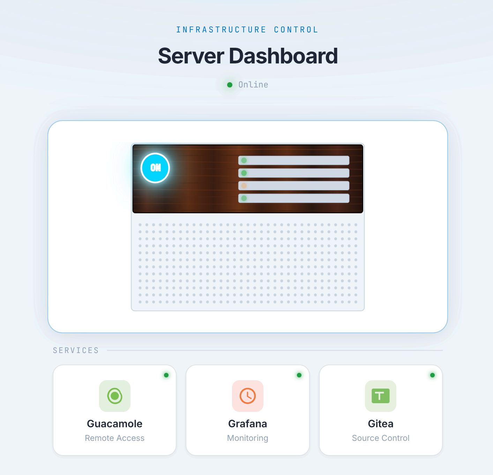

# ESP32 Server Management Dashboard

<div align="center">


A physical one-click power switch for your home server — built on an ESP32.



</div>

## Overview

This project turns an ESP32 into a tiny always-on web server that lets you boot and shut down a home server (or NAS) from any device on your local network — no SSH, no VPN, no laptop required.

The ESP32 sits permanently on the network and serves a browser-based dashboard. From there you can:

- **Power on** the server by sending a Wake-on-LAN magic packet over UDP.
- **Shut down** the server by calling a remote API endpoint on the server itself.
- **Monitor** whether the server and its services (Gitea, Grafana, Guacamole) are currently reachable.

The dashboard polls the ESP32 every 30 seconds to reflect the current state. A background FreeRTOS task probes the server over HTTPS every 15 seconds and updates an internal state singleton that all HTTP handlers read from.

Because the ESP32 draws only a few milliwatts in idle, it can stay on around the clock while the main server sleeps.

Built with the [ESP32 MiniWebServer Framework](https://github.com/LemurDaniel/ESP32__MiniWebServer-Framework).

May not work with RISC-V based ESP32 variants:
- ESP32-C3
- ESP32-C6
- ESP32-H2

Should work with:
- ESP32 (WROOM, WROVER, CAM ...)
- ESP32-S2
- ESP32-S3

## 📁 Project Structure

```
📦 ESP32 Server Management Dashboard
├── 📁 src/
│   ├── 🎯 main.cpp                          # Server setup & route registration
│   └── 📁 routes/
│       ├── 🖥️ routes.server.manager.h/.cpp  # Power on/off + status polling
│       └── 🛤️ routes.example.h/.cpp         # Example routes
├── 📁 data/
│   └── 📁 web/
│       ├── 🎨 index.html                    # Dashboard UI (SVG + JS)
│       └── 🎨 main.css                      # Styles
├── 📁 include/                              # Shared headers
├── 📋 library.json                          # PlatformIO library config
├── ⚙️ platformio.ini                        # Build targets
└── 📖 README.md
```

## 🔗 Built With

> **[ESP32 MiniWebServer Framework](https://github.com/LemurDaniel/ESP32__MiniWebServer-Framework)**
> A lightweight HTTP server framework for ESP32 — routing, LittleFS file serving, WiFi management, and a built-in admin dashboard.
> Add it to any PlatformIO project via `lib_deps` and include `server.h`.

## 🙏 Acknowledgments

- 🎉 **Arduino Community** for the amazing ecosystem
- 🔧 **PlatformIO** for the excellent development platform
- 🌐 **ESP32** community for inspiration and support
- 💖 **Open Source** contributors worldwide
